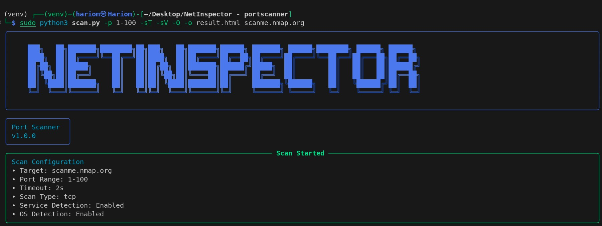

# NetInspector - Port Scanner

NetInspector is a port scanning tool that offers various scan options, including TCP connect, SYN, service version detection, and OS fingerprinting. It allows you to scan individual hosts or entire subnets.

## Key Features

- **Port Scanning**: Scan a target for open ports within a specified range.
- **Scan Types**: Choose between TCP Connect Scan, SYN Scan, or a Basic Scan.
- **Service Detection**: Identify the services running on open ports.
- **OS Detection**: Detect the operating system of the target host.
- **Subnet Scanning**: Scan an entire subnet (CIDR notation) for alive hosts.
- **Output**: Save the scan results to a text file or HTML report.

## Usage

```bash
python3 scan.py <target> [options]
Options:

-p, --ports: Specify the port range to scan (e.g., 1-1000)
-t, --timeout: Set the timeout for each connection (in seconds)
-sT: Perform TCP Connect Scan
-sS: Perform SYN (half-open) Scan
-sV: Enable service version detection
-O, --os_detection: Enable OS detection
-o, --output: Save the scan results to a file (use .html for HTML output)

Examples:

Scan a domain:
python3 scan.py scanme.nmap.org
python3 scan.py -p 1-100 -sS scanme.nmap.org
python3 scan.py -sT -p 1-100 -sV -O -o scan.txt scanme.nmap.org

Scan an IP address:
python3 scan.py -p 1-100 -sT 192.168.1.41 
python3 scan.py -sV 10.10.101.219
python3 scan.py -sS -p 1-2000 -sV -O -o scan_result.txt 192.168.130.147

Scan a subnet (CIDR):
python3 scan.py -p 1-100 -sT 192.168.1.0/24 
python3 scan.py -sV 192.168.130.0/24
```

## Installation

Clone the repository:
clone https://github.com/Hari0mSingh/NetInspector-PortScanner.git

Install the required dependencies:
cd netinspector
pip install -r requirements.txt

Run the tool:
python3 scan.py

## Contributing
If you find any issues or have suggestions for improvements, feel free to open an issue or submit a pull request.
### License
This project is licensed under the MIT License.
### Disclaimer
NetInspector is intended for authorized network testing and learning purposes. Unauthorized use of this tool against targets without permission is prohibited.